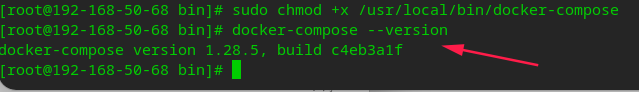
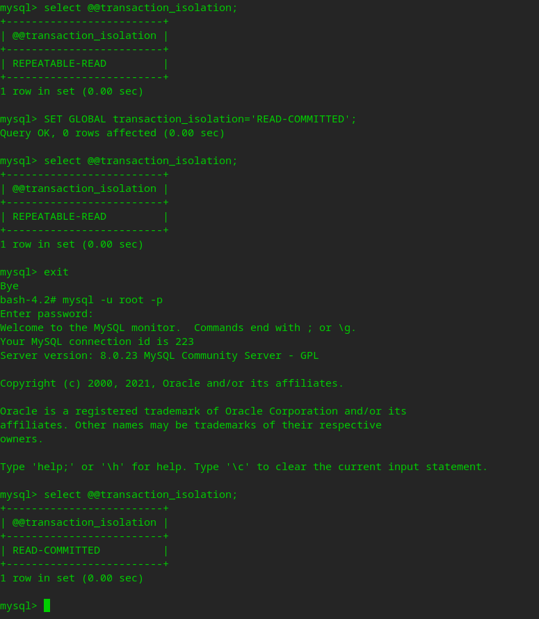
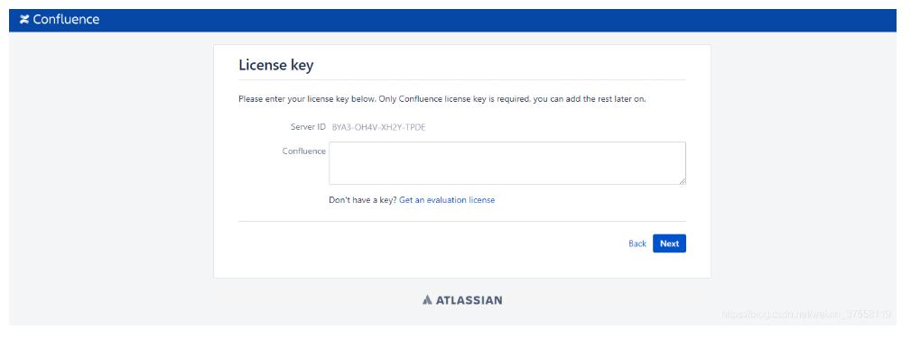
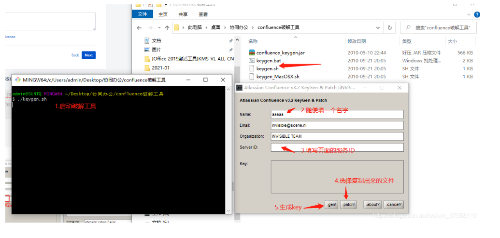
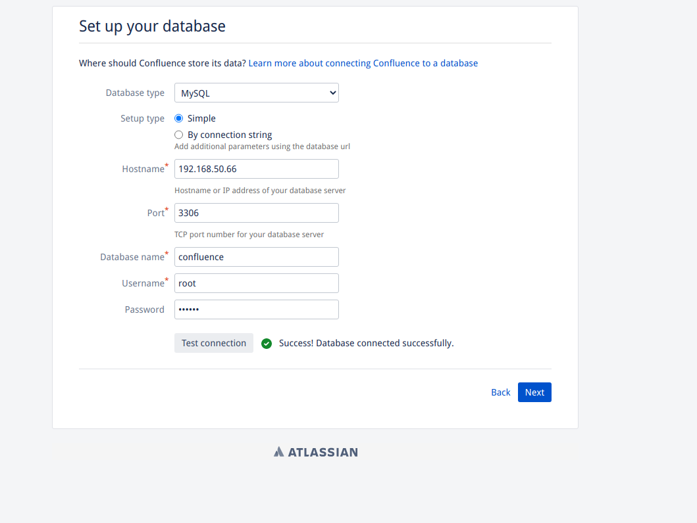
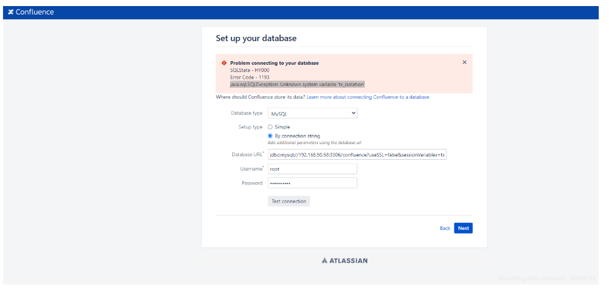
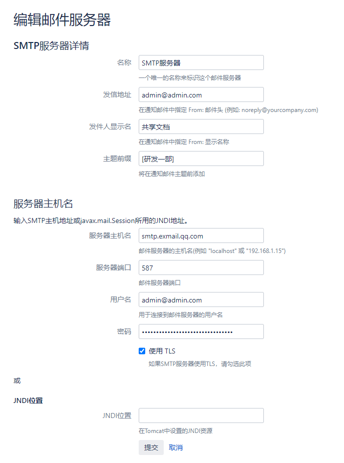

# Confluence安装破解

## 一,docker-compose安装Confluence

### 需要预装docker ,docker-compose

默认情况下，windows 和 mac 下的 docker 已经自带了 docker-compose 工具，可以使用 `docker-compose -v` 命令查看。

对于 linux 系统，需要自己手动安装 https://docs.docker.com/compose/install/

1. 运行以下命令以下载Docker Compose的当前稳定版本 (有时访问不了gitlab,需要走代理)：

```
sudo curl -L "https://github.com/docker/compose/releases/download/1.28.5/docker-compose-$(uname -s)-$(uname -m)" -o /usr/local/bin/docker-compose
```

2. 将可执行权限应用于二进制文件：

```
sudo chmod +x /usr/local/bin/docker-compose
```

3. 测试安装 成功/失败：

```
docker-compose --version
```



### 1. 安装mysql

通过docker-compose安装mysql-server:8.0 

定位到用户根目录`cd ~`

新建文件夹： `mkdir mysql-docker-compose`

进入：`cd mysql-docker-compose`

新建文件`vi docker-compose.yaml`

把下面的yaml文件粘贴进去。

docker-compose.yaml ：

```
version: '3'
services:
 mysql:
  image: harbor.hfvast.net/docker_hub_proxy/mysql/mysql-server:8.0
  container_name: confluence_mysql
  restart: always
  ports:
   - "3306:3306" 
  volumes:
   - ./db_data:/var/lib/mysql
  environment:
   MYSQL_ROOT_PASSWORD: V3ep3sn,._
   MYSQL_ROOT_HOST: "%"

```

保存退出。

执行：`docker-compose up -d` 安装并启动mysql

### 2. 修改数据库的隔离级别为 READ-COMMITTED

mysql默认的数据库隔离级别为：REPEATABLE-READ

查看正在运行的容器：docker ps

进入mysql容器： ` docker exec -it yanfa_mysql /bin/bash`

连接mysql：`mysql -uroot -p123456`

查询隔离级别 :
`select @@transaction_isolation; `
设置全局隔离级别 
`SET GLOBAL transaction_isolation='READ-COMMITTED'; `




### 3. 创建数据库

在准备好的MySQL8中创建数据库 

create database confluence DEFAULT CHARACTER SET utf8 COLLATE utf8_bin; 

### 4. 安装confluence

通过docker-compose安装confluence-server:latest 

定位到用户根目录`cd ~`

新建文件夹： `mkdir confluence-docker-compose`

进入：`cd confluence-docker-compose`

新建文件`vi docker-compose.yaml`

把下面的yaml文件粘贴进去。

docker-compose.yaml ：

```
version: '3' 
services: 
  confluence: 
    image: atlassian/confluence-server:latest 
    container_name: confluence 
    restart: always 
    ports: 
      - 8090:8090 
      - 8091:8091 
    networks: 
      - traefik 
    volumes: 
      - ./data:/var/atlassian/application-data/confluence 
      - ./mysql-connector-java-8.0.22.jar:/opt/atlassian/confluence/confluence/WEB-INF/lib/mysql-connector-java-8.0.22.jar 
      # - ./atlassian-extras-2.4.jar:/opt/atlassian/confluence/confluence/WEB-INF/lib/atlassian-extras-decoder-v2-3.4.1.jar # 如果你有已经破解后的jar包，这里直接挂在进去即可启动 
      # - ./server.xml:/opt/atlassian/confluence/conf/server.xml 
networks: 
  traefik: 
    external: true 
 
```

保存退出。

confluence需要连接数据库的驱动：

在当前路径下执行： `wget  https://repo1.maven.org/maven2/mysql/mysql-connector-java/8.0.22/mysql-connector-java-8.0.22.jar `

创建网卡：`docker network create traefik `

最后在当前路径下执行：`docker-compose up -d` 安装并启动confluence

访问地址：yourIp:8090 

## 二,破解Confluence

win下载破解工具 
http://image.baishapu.com/confluence破解工具.zip 


1.复制出 atlassian 的 jar 包，注意复制出来的文件名必须为 atlassian-extras-2.4.jar，因为破解工具中指定了此文件名：

定位到用户根目录：`cd ~`

复制出 atlassian 的 jar 包：`docker cp confluence:/opt/atlassian/confluence/confluence/WEB-INF/lib/atlassian-extras-decoder-v2-3.4.1.jar ./atlassian-extras-2.4.jar `

2.浏览器中登录ip:8090，找到Server ID，破解会用到 



3.win下破解如图



4.复制破解后的jar包挂载到容器中：

放到confluence-docker-compose文件夹内并修改docker-compose.yaml

```
version: '3' 
services: 
  confluence: 
    image: atlassian/confluence-server:latest 
    container_name: confluence 
    restart: always 
    ports: 
      - 8090:8090 
      - 8091:8091 
    networks: 
      - traefik 
    volumes: 
      - ./data:/var/atlassian/application-data/confluence 
      - ./mysql-connector-java-8.0.22.jar:/opt/atlassian/confluence/confluence/WEB-INF/lib/mysql-connector-java-8.0.22.jar 
      - ./atlassian-extras-2.4.jar:/opt/atlassian/confluence/confluence/WEB-INF/lib/atlassian-extras-decoder-v2-3.4.1.jar 
      # - ./server.xml:/opt/atlassian/confluence/conf/server.xml 
networks: 
  traefik: 
    external: true 
```

5.重启confluence 

``docker-compose up -d` 

重启后把工具生成的key粘贴进去

破解完成


## 三,可能遇到的问题

正常数据库设置界面：



1.可能提示需要驱动，这时应检查挂载的mysql驱动jar包是否正确挂载

2.出现下图情况的解决方法



分析：如果用已有数据库并且按上面说的设置过隔离级别了就直接用 Simple 直接用户名密码连接就行，如果使用的数据库的隔离级别不是READ-COMMITTED，则可在用URL连接在会话上设置隔离级别，注意MySQL8+的关键字是transaction_isolation，以前的才是tx_isolation 

## 四,设置

1）配置邮件服务器 



- 采用25号端口和465号端口后依然不行。找到Confluence官网的配置说明，看到了一行字： 
  SMTP Port Optional. The port to connect to on the SMTP host. FishEye needs to use port 25 or 
  port 587, because unlike JIRA its initial connection doesn’t use SSL. Port 25 will be used if no 
  port is specified. 
- 端口要用 587 使用TLS 
- 这里总结一下这些坑，首先服务器部署在阿里云的ECS上面，端口号25是默认关闭的，465端口虽然开启，但是服务器连接超时了，这个只是针对我的这个confluence应用的，对于其它使用Java编写的应用不一定适用，请甄别。587端口是一个邮件里面也会使用的端口，腾讯企业邮箱虽然没有明确说明使用了这个端口，但是经过尝试，确实发现可以使用587端口发送，这也是官方推荐的端口号。网易邮箱则没有这个功能。 

2）需要的备份 

1、备份mysql数据库； 

2、备份mysql驱动； 

3、备份主目录（本文档安装的挂载目录 “- ./data:/var/atlassian/application-data/confluence”） 

4、备份server.xml（容器目录： /opt/atlassian/confluence/conf/server.xml） 

5、在新机器上准备好安装过程需要的东西，以及备份的东西拿过去准备覆盖； 

6、如果需要迁移数据库，可以直接修改配置文件：<confluence.home>/confluence.cfg.xml 

