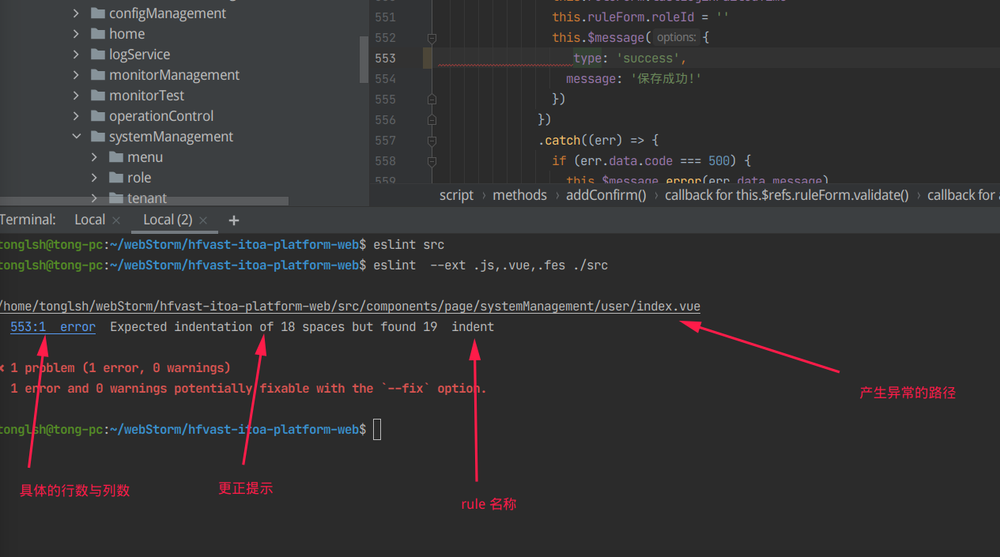
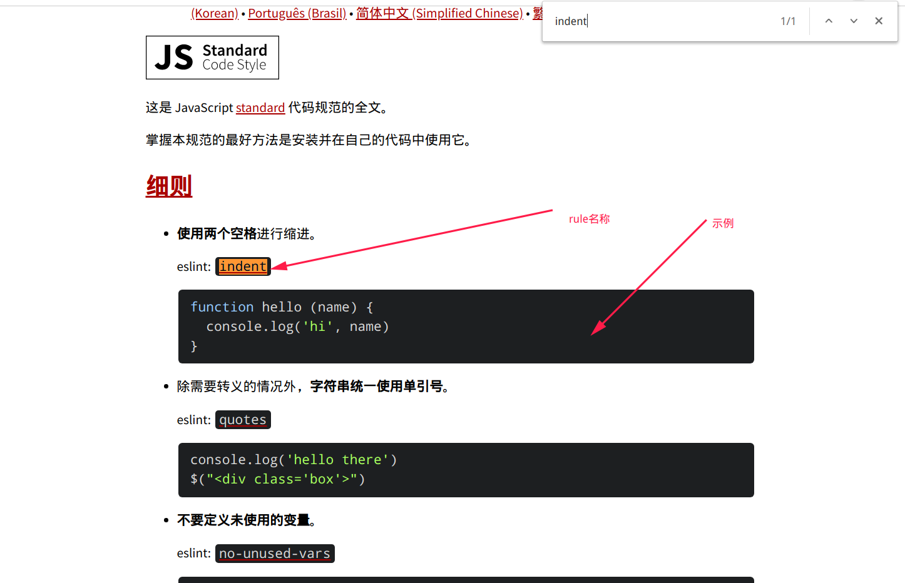
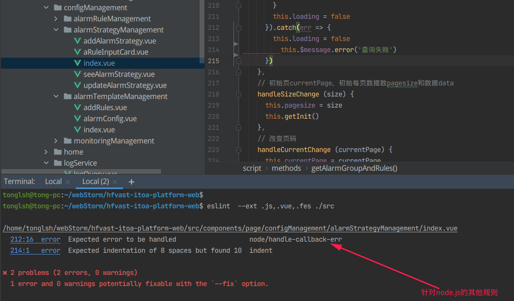
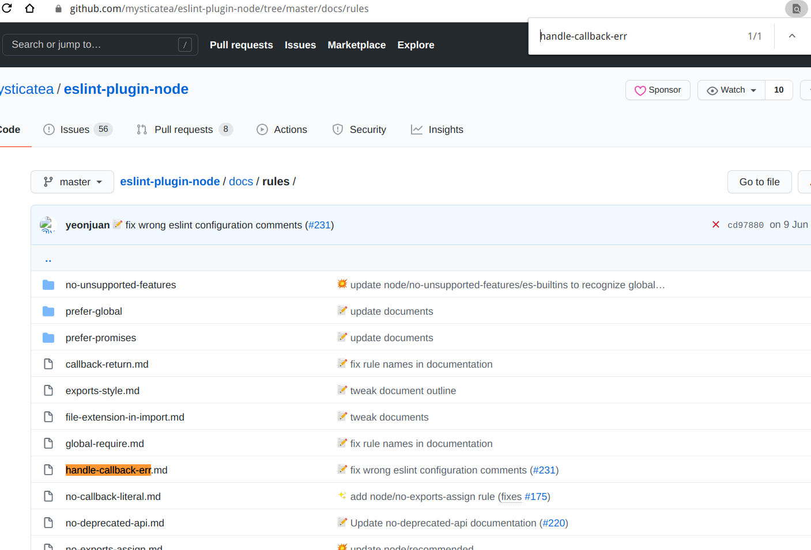
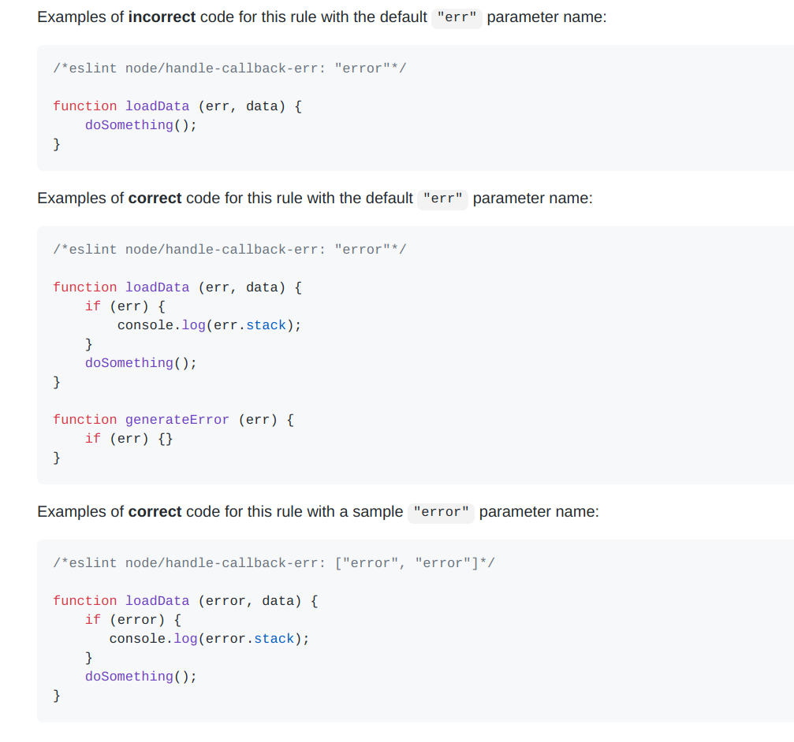
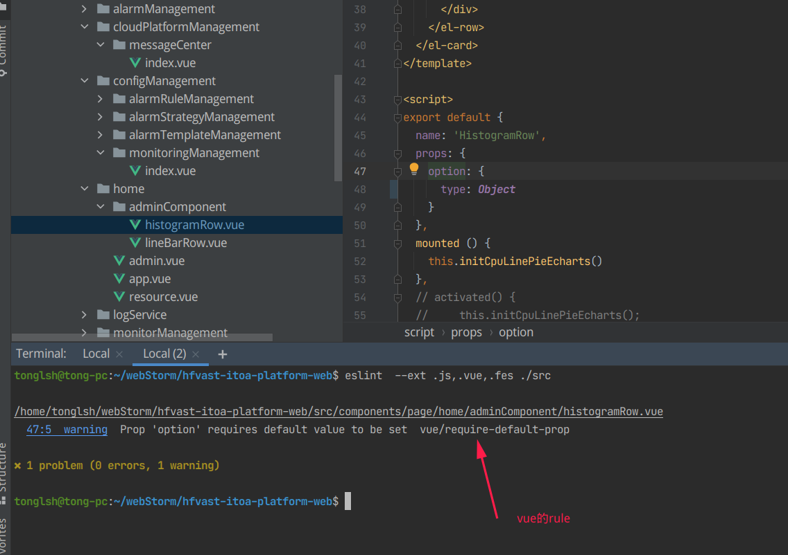
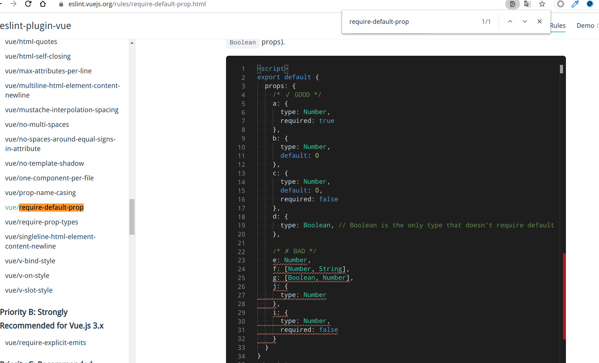
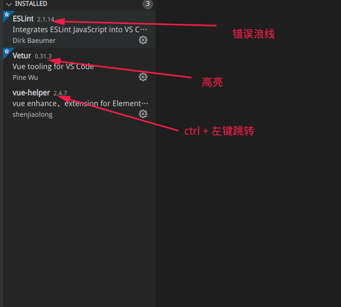
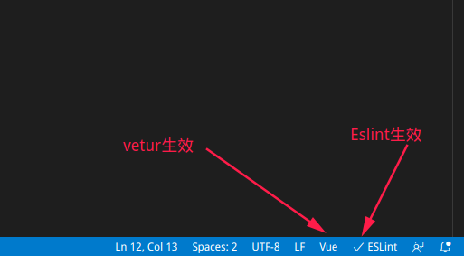
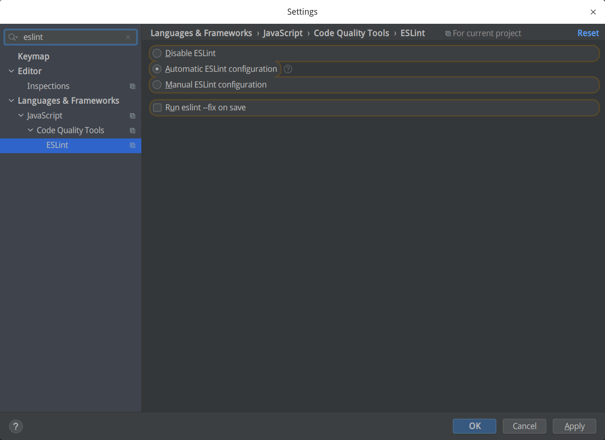

# 基于的代码规范

## eslint-config-standard

> 用于JavaScript标准样式的ESLint Config

https://standardjs.com/rules-zhcn.html#javascript-standard-style

## eslint-plugin-vue

> Vue.js的官方ESLint插件
>
> 该插件使我们可以使用ESLint检查.vue文件的`<template>`和`<script>`以及.js文件中的Vue代码。

**采用 vue/strongly-recommended**（vue2.x官方推荐的规则 ）

https://eslint.vuejs.org/rules/attribute-hyphenation.html

## eslint-plugin-node

> ESLint针对Node.js的其他规则

https://github.com/mysticatea/eslint-plugin-node/tree/master/docs/rules

## eslint-plugin-import

> 该插件旨在支持ES2015 +（ES6 +）导入/导出语法的检查，并防止文件路径和导入名称拼写错误的问题

https://github.com/benmosher/eslint-plugin-import#sublimelinter-eslint

# 如何更正？

> 一些简单的缩进，单引号等等可以实现自动更正 --fix
>
> 还有很多的格式问题需要手动修改，下面列出几个流程供参考

## 例1

### 普通的rule 属于eslint-config-standard（已提供文档链接）

### 如果一些异常不能通过更正提示理解的话，可以去上面提供的链接查找实例

## 例二

### node/ 开头的rule，属于eslint-plugin-node （已提供文档链接）

### 去eslint-plugin-node的gitlab仓库寻找文档

### 提供正确和错误的代码示例

## 例三

### vue/ 开头的rule，属于vue/strongly-recommended （已提供文档链接）

### 正确or错误代码示例

# 让eslint变得更好

在使用过程中请不要修改配置文件 .eslintrc.js

如果觉得某个rule影响开发效率，臃肿or没必要，可以提出修改rule的请求，使eslint更贴合使用习惯。

但不要私自修改！

# IDE的配置

### vscode 插件

**验证**：

Webstrom只需检查setting内的eslint是否禁用

