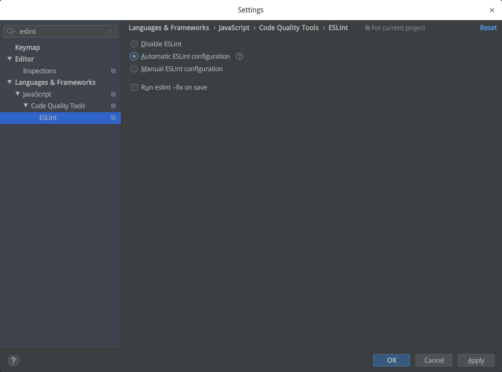
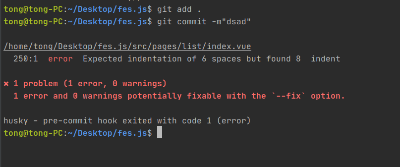
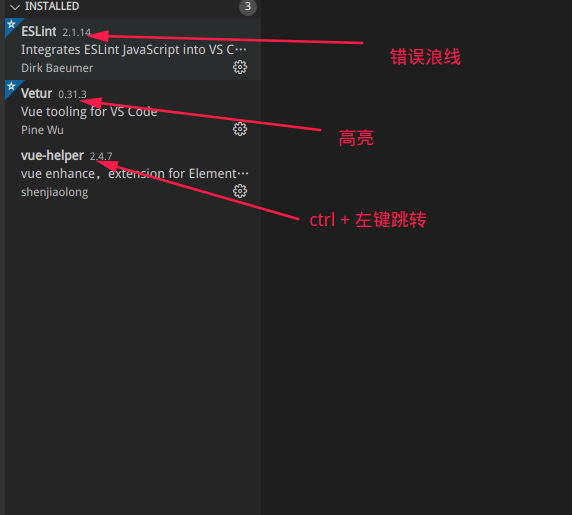
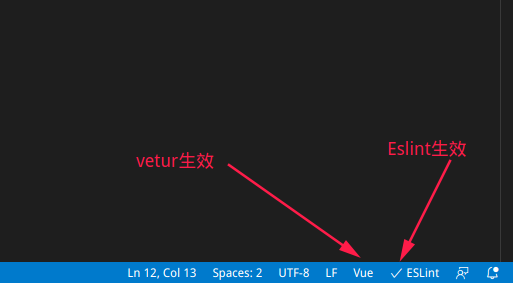

# ESLint

> 在对比了一些成熟的规范方案后，选择standard与vue/strongly-recommended作为规范标准
>
> 支持自定义配置：rule下的规则会覆盖extends

## 安装

```text
npm install eslint --save-dev
```

## 在项目中执行

```text
./node_modules/.bin/eslint --init
```

## 问答式配置

```
? How would you like to use ESLint? To check syntax, find problems, and enforce code style
? What type of modules does your project use? JavaScript modules (import/export)
? Which framework does your project use? Vue.js
? Does your project use TypeScript? No
? Where does your code run? Browser
? How would you like to define a style for your project? Use a popular style guide
? Which style guide do you want to follow? Standard: https://github.com/standard/standard
? What format do you want your config file to be in? JavaScript
```

## 根据配置eslint自动安装的包

```
+ eslint-plugin-vue@7.4.1
+ eslint-config-standard@16.0.2
+ eslint@7.17.0
+ eslint-plugin-node@11.1.0
+ eslint-plugin-import@2.22.1
+ eslint-plugin-promise@4.2.1
```

## 不指定解析器的时候，eslint默认使用 Espree 作为其解析器，为了更好地兼容 babel，推荐使用 babel-eslint 作为解析器

```javascript
module.exports = {
  env: {
    browser: true,
    es6: true,
    node: true
  },
  extends: [
    'standard',
    'plugin:vue/strongly-recommended'
  ],
  globals: {
    Atomics: 'readonly',
    SharedArrayBuffer: 'readonly'
  },
  parserOptions: {
    parser: 'babel-eslint',
    ecmaVersion: 2018,
    sourceType: 'module'
  },
  plugins: [
    'vue'
  ],
  rules: {
  }
}
```

## 对Vue文件的检测支持必须要导入vue的规则

https://eslint.vuejs.org/rules/对于vue2.x ，选择strongly-recommended

### 优先级B：强烈推荐（提高可读性） 适用于Vue.js 2.x

强制执行以下类别中的所有规则以及所有更高优先级的规则：

🔧表示规则是可修复的，并`--fix`在[命令行](https://eslint.org/docs/user-guide/command-line-interface#fixing-problems)上使用选项[ （在新窗口中打开）](https://eslint.org/docs/user-guide/command-line-interface#fixing-problems)可以自动修复某些已报告的问题。

##

```json
{
  "extends": "plugin:vue/strongly-recommended"
}
```

| 规则编号                                                     | 描述                                     |      |
| :----------------------------------------------------------- | :--------------------------------------- | :--- |
| [vue/attribute-hyphenation](https://eslint.vuejs.org/rules/attribute-hyphenation.html) | 在模板中的自定义组件上实施属性命名样式   | 🔧    |
| [vue/component-definition-name-casing](https://eslint.vuejs.org/rules/component-definition-name-casing.html) | 对组件定义名称强制使用特定的大小写       | 🔧    |
| [vue/html-closing-bracket-newline](https://eslint.vuejs.org/rules/html-closing-bracket-newline.html) | 在标签的右括号之前要求或禁止换行         | 🔧    |
| [vue/html-closing-bracket-spacing](https://eslint.vuejs.org/rules/html-closing-bracket-spacing.html) | 在标签的右括号之前需要或不允许使用空格   | 🔧    |
| [vue/html-end-tags](https://eslint.vuejs.org/rules/html-end-tags.html) | 强制结束标签样式                         | 🔧    |
| [vue/html-indent](https://eslint.vuejs.org/rules/html-indent.html) | 强制一致的缩进 `                         | 🔧    |
| [vue/html-quotes](https://eslint.vuejs.org/rules/html-quotes.html) | 强制使用HTML属性的引号样式               | 🔧    |
| [vue/html-self-closesing](https://eslint.vuejs.org/rules/html-self-closing.html) | 实施自我关闭风格                         | 🔧    |
| [vue/max-attributes-per-line](https://eslint.vuejs.org/rules/max-attributes-per-line.html) | 强制每行的最大属性数                     | 🔧    |
| [vue/multiline-html-element-content-newline](https://eslint.vuejs.org/rules/multiline-html-element-content-newline.html) | 在多行元素的内容之前和之后需要换行       | 🔧    |
| [vue/no-multi-spaces](https://eslint.vuejs.org/rules/no-multi-spaces.html) | 在胡子插值中强制统一间距                 | 🔧    |
| [vue/no-spaces-around-equal-signs-in-attribute](https://eslint.vuejs.org/rules/no-spaces-around-equal-signs-in-attribute.html) | 不允许多个空格                           | 🔧    |
| [vue/no-spaces-around-equal-signs-in-attribute](https://eslint.vuejs.org/rules/no-spaces-around-equal-signs-in-attribute.html) | 禁止属性中等号周围的空格                 | 🔧    |
| [vue/no-template-shadow](https://eslint.vuejs.org/rules/no-template-shadow.html) | 禁止在外部范围中声明的阴影变量中声明变量 |      |
| [vue/one-component-per-file](https://eslint.vuejs.org/rules/one-component-per-file.html) | 强制每个组件应位于其自己的文件中         |      |
| [vue/prop-name-casing](https://eslint.vuejs.org/rules/prop-name-casing.html) | 在Vue组件中为Prop名称强制使用特定大小写  |      |
| [vue/require-default-prop](https://eslint.vuejs.org/rules/require-default-prop.html) | 需要道具的默认值                         |      |
| [vue/require-prop-types](https://eslint.vuejs.org/rules/require-prop-types.html) | 在props中需要类型定义                    |      |
| [vue/singleline-html-element-content-newline](https://eslint.vuejs.org/rules/singleline-html-element-content-newline.html) | 在单行元素的内容之前和之后需要换行       | 🔧    |
| [vue/v-bind-style](https://eslint.vuejs.org/rules/v-bind-style.html) | 强制`v-bind`指令样式                     | 🔧    |
| [vue/v-on-style](https://eslint.vuejs.org/rules/v-on-style.html) | 强制`v-on`指令样式                       | 🔧    |
| [vue/v-slot-style](https://eslint.vuejs.org/rules/v-slot-style.html) | 强制`v-slot`指令样式                     | 🔧    |

## eslint并不会自己去检测代码:

我们可以手动执行 eslint file 命令进行代码检测


## 自动的错误提示:

需要编辑器的支持(选中Run eslint --fix on save 可在保存时格式化代码)




## pre-commit 钩子函数

> 通过git的pre-commit hook，可以实现在git commit时自动检查代码格式，并给出提示信息。
>
> 通过配置，在CI持续集成阶段做lint，若没有通过则无法进行后续步骤。
>
> 为了缩短 Lint 的反馈链条，把 Lint 挪到本地是最有效的办法。常见做法是使用 [husky](https://link.zhihu.com/?target=https%3A//github.com/typicode/husky) 或者 [pre-commit](https://link.zhihu.com/?target=https%3A//github.com/observing/pre-commit) 在本地提交之前做 Lint。


husky:https://typicode.github.io/husky/#/?id=install

```
npm install husky@next --save-dev

husky install

husky add .husky/pre-commit "eslint -c ./.eslintrc.js   --ext .js,.vue,.fes ./src"
```



--------------------

## standard代码规范

https://standardjs.com/rules-zhcn.html#javascript-standard-style

## vue/strongly-recommended 代码规范

https://eslint.vuejs.org/rules/attribute-hyphenation.html

## eslint-plugin-node规范

https://github.com/mysticatea/eslint-plugin-node/tree/master/docs/rules

### vscode 插件




**验证**：

