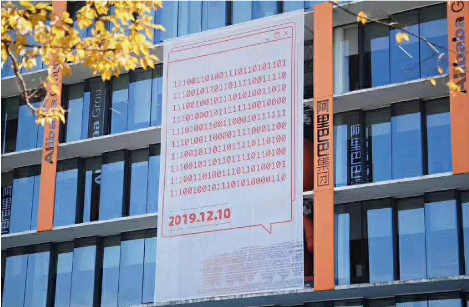

# UTF 编码



```java
public static void main(String[] args) {
    ArrayList<Integer> list = new ArrayList<Integer>();
    //手动转成unicode
    list.add(0b0110011101101101);
    list.add(0b0101110111011110);
    list.add(0b0100111010011010);
    list.add(0b1000111111010000);
    list.add(0b1001011000111111);
    list.add(0b1001000111001100);
    list.add(0b0101110111110100);
    list.add(0b0101110111110100);
    list.add(0b0110011101100101);
    list.add(0b0100111010000110);

    for (Integer b : list) {
        System.out.print((char)Integer.valueOf(Integer.toHexString(b), 16).intValue());
    }
}
```

简单来说：

* Unicode 是「字符集」
* UTF-8 是「编码规则」 

其中：

* 字符集：为每一个「字符」分配一个唯一的 ID（学名为码位 / 码点 / Code Point）
* 编码规则：将「码位」转换为字节序列的规则（编码/解码 可以理解为 加密/解密 的过程）

广义的 Unicode 是一个标准，定义了一个字符集以及一系列的编码规则，即 Unicode 字符集和 UTF-8、UTF-16、UTF-32 等等编码……

Unicode 字符集为每一个字符分配一个码位，例如「知」的码位是 30693，记作 U+77E5（30693 的十六进制为 0x77E5）。

UTF-8 顾名思义，是一套以 8 位为一个编码单位的可变长编码。会将一个码位编码为 1 到 4 个字节：

```
U+ 0000 ~ U+ 007F: 0XXXXXXX
U+ 0080 ~ U+ 07FF: 110XXXXX 10XXXXXX
U+ 0800 ~ U+ FFFF: 1110XXXX 10XXXXXX 10XXXXXX
U+10000 ~ U+10FFFF: 11110XXX 10XXXXXX 10XXXXXX 10XXXXXX
```

根据上表中的编码规则，之前的「知」字的码位 U+77E5 属于第三行的范围：

```
       7 	7 	 E 	  5
    0111 0111 1110 0101 二进制的 77E5
--------------------------
    0111   011111   100101 二进制的 77E5
1110XXXX 10XXXXXX 10XXXXXX 模版（上表第三行）
11100111 10011111 10100101 代入模版
     E 7      9 F      A 5
```

这就是将 U+77E5 按照 UTF-8 编码为字节序列 E79FA5 的过程。反之亦然。