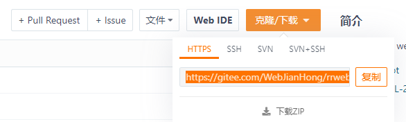
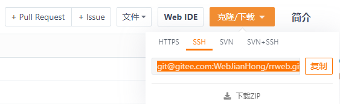
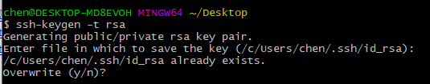
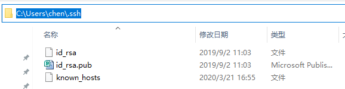
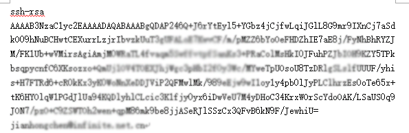
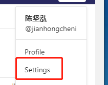
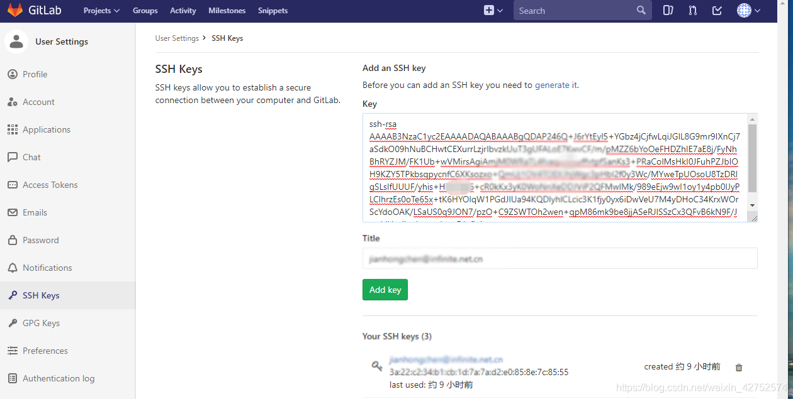
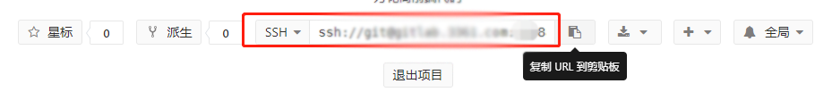

# ssh获取公钥,绑定gitlab,ssh-keygen -t rsa命令详解（转载）

换电脑，重装系统后配置环境需要绑定ssh公钥，记录。

### git仓库克隆项目时HTTPS跟SSH区别

这两种方式的主要区别在于：
使用`https url克隆`对初学者来说会比较方便，复制`https url`然后到`git Bash`里面直接用clone命令克隆到本地

但是每次`fetch`和`push`代码都需要`输入账号和密码`，这也是https方式的麻烦之处。

而使用`SSH url克隆`却需要在克隆之前`先配置和添加好SSH key`，因此，如果你想要使用`SSH url克隆`的话，你必须是这个项目的拥有者。

否则你无法添加`SSH key`，另外`ssh默认每次fetch和push代码不需要输入账号和密码`，如果你想要每次都输入账号密码才能进行fetch和push也可以另外进行设置。

`HTTPS克隆地址`
https://gitee.com/WebJianHong/rrweb.git

`SSH克隆地址`
git@gitee.com:WebJianHong/rrweb.git

### 通过命令ssh-keygen -t rsa 获取公钥

Enter file in which to save the key (/c/Users/chen/.ssh/id_rsa):指定生成的文件名(公钥会在文件里,用记事本打开可以复制)

Overwrite (y/n)? : 我不是首次输入这命令,是否要覆盖的意思

输完命令后
在我的`/c/Users/chen/.ssh`文件夹下,会有几个文件,
`id_rsa(私钥)`
`id_rsa.pub(公钥)`

用记事本打开id_rsa.pub文件,复制里面内容

### 在gitlab上绑定公钥

setting→SSH Keys→Add an SSH key

绑定好了后,就可以正常`git clone SSH`地址，将gitlab上项目克隆到本地了

### ssh-keygen命令解释

### ssh-keygen -t rsa -C “youremail.com”

在用Git生成密钥的时候，查询到的命令是：
`ssh-keygen -t rsa -C "邮件地址@youremail.com"`
和
`ssh-keygen -t rsa -b 4096 -C "邮件地址@youremail.com"`

### ssh

SSH 为`Secure Shell` 的缩写，SSH 为建立在应用层基础上的`安全协议`。

SSH 是目前较可靠，专为远程登录会话和其他网络服务提供安全性的协议。

利用 SSH 协议可以有效防止远程管理过程中的信息泄露问题。

### ssh-keygen
从客户端来看，SSH提供两种级别的安全验证：

* 第一种级别（基于口令的安全验证）：只要你知道自己帐号和口令，就可以登录到远程主机。所有传输的数据都会被加密，但是不能保证你正在连接的服务器就是你想连接的服务器。可能会有别的服务器在冒充真正的服务器，也就是受到“中间人”这种方式的攻击。
*  第二种级别（基于密钥的安全验证）`ssh-keygen`：需要依靠`密钥`，这里的密钥是非对称密钥。

### t : t是type的缩写

`-t`即指定密钥的类型，密钥的类型有两种，一种是`RSA`，一种是`DSA`

### RSA和DSA

- RSA：RSA加密算法是一种非对称加密算法，是由三个麻省理工的牛人弄出来的，RSA是他们三个人姓的开头首字母组合。
- DSA：Digital Signature Algorithm (DSA)是Schnorr和ElGamal签名算法的变种。

为了让两个linux机器之间`使用ssh不需要用户名和密码`。所以采用了数字签名RSA或者DSA来完成这个操作。

`ssh-keygen默认使用rsa密钥`，所以不加-t rsa也行，如果你想生成dsa密钥，就需要加参数-t dsa。

#### b ：b是bit的缩写

-b 指定密钥长度。

### 4096
对于RSA密钥，最小要求768位，默认是2048位。4096指的是RSA密钥长度为4096位。
DSA密钥必须恰好是1024位(FIPS 186-2 标准的要求)。

### C:comment的缩写
-C表示提供一个`注释`，用于识别这个密钥。` 可以省略`.

### “邮件地址@youremail.com”：用于识别这个密钥的注释内容
引号里的内容为`注释的内容`，所以"双引号里面`不一定得填邮箱`，可以输入`任何内容`。