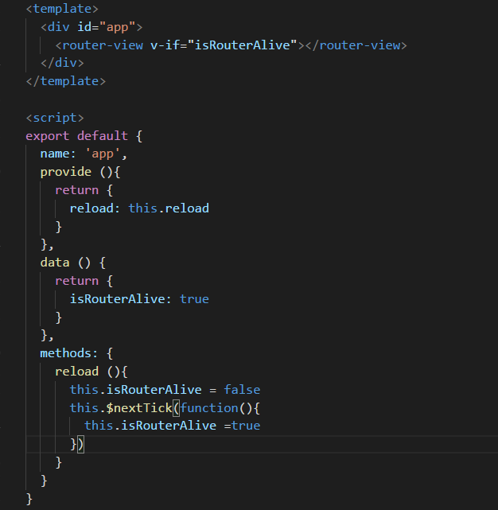
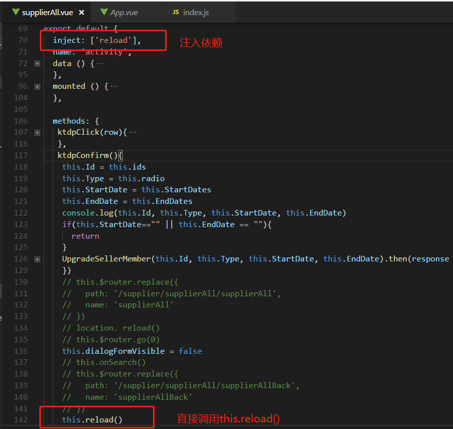

### maven库 本地安装

mvn install -D maven.test.skip=true


### javascript函数怎样跳转页面

1.在原来的窗体中直接跳转用
window.location.href=``"你所要跳转的页面"``;
2、在新窗体中打开页面用：
window.open(``'你所要跳转的页面'``);
window.history.back(-1);返回上一页

3、一些用法
按钮式：
`"pclog"` `type=``"button"` `value=``"/GO"` `onClick=``"location.href='连接地址'"``>
链接式：`"javascript:history.go(-1)"``>返回上一页
< a href=``"<%=Request.ServerVariables("``HTTP_REFERER``")%>"``>返回上一页
直接跳转式：<script>window.location.href='连接地址';</script>


### provide / inject 组合 实现组件自由刷新



通过声明reload方法，控制router-view的显示或隐藏，从而控制页面的再次加载，这边定义了

```
isRouterAlive //true or false 来控制
```

然后在需要当前页面刷新的页面中注入App.vue组件提供（provide）的 reload 依赖，然后直接用this.reload来调用就行




查看分区挂载情况

**df -Th** 


蓝鲸 docker

docker run -d -p 8081:8090 ccr.ccs.tencentyun.com/bk.io/cmdb-standalone:latest